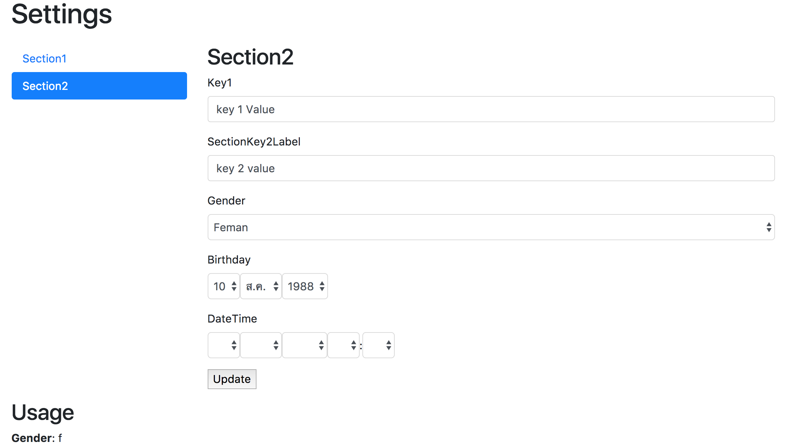

# PhpMob Settings
[](https://scrutinizer-ci.com/g/phpmob/settings/?branch=master)
[](https://scrutinizer-ci.com/g/phpmob/settings/?branch=master)
[](https://travis-ci.org/phpmob/settings)
[](https://packagist.org/packages/phpmob/settings)
[](//packagist.org/packages/phpmob/settings)

Just a Settings Library.

## Installation
Install via composer.

```bash
$ composer require phpmob/settings-bundle
```

Using with cache

```bash
$ composer require cache/filesystem-adapter
```

Now you can use built-in `\PhpMob\Settings\Manager\CachedManager`.

Alternative using built-int symfony framework cache see - [framework/cache](https://symfony.com/doc/current/reference/configuration/framework.html#reference-cache)

## Sample config

```yaml

# use with doctrine orm
doctrine:
    orm:
        mappings:
            PhpMobSettings:
                type: xml
                is_bundle: false
                prefix: PhpMob\Settings\Model
                dir: '%kernel.project_dir%/vendor/phpmob/settings-bundle/src/Resources/config/doctrine/model'


phpmob_settings:
    cache:
        service: cache.flysystem
    schemas:
        section1:
            label: Section1
            settings:
                key1: ~
        section2:
            label: Section2
            settings:
                key1:
                    value: key1Value
                key2:
                    label: SectionKey2
                    value: key2value
                    blueprint:
                        options:
                            label: SectionKey2Label
                        constraints:
                            NotBlank: ~
                gender:
                    label: Gender
                    value: f
                    blueprint:
                        type: Symfony\Component\Form\Extension\Core\Type\ChoiceType
                        options:
                            required: true
                            choices:
                                Man: m
                                Feman: f
                birthday:
                    type: date
                    label: Birthday
                    value: "1988-02-10"
                    blueprint:
                        type: Symfony\Component\Form\Extension\Core\Type\BirthdayType
                datetime:
                    type: datetime
                    label: DateTime
                    value: ~
                    blueprint:
                        type: Symfony\Component\Form\Extension\Core\Type\DateTimeType

```

## Updater Routing
See example routing in `src/Resources/config/routing.xml` or you can customize with:
```yaml
your_route_name:
    path: /settings/{section}
    defaults:
        _controller: PhpMobSettingsBundle:Update:globalUpdate
        _template: @yourtemplate # default @PhpMobSetting/default.html.twig
        _flash: ~ # flash message after update
        _redirect: ~ # redirect after update

```

## using in twig
Getter setting
```twig
{{ settings_get('section.key') }}
{{ settings_get('section.key', app.user) }}
```

Setter setting
```twig
{{ settings_set('section.key', 'value') }}
{{ settings_set('section.key', 'value', app.user) }}
```

## Sample Admin Screen


## Contributing
Would like to help us and build the developer-friendly php code? Just follow our [Coding Standards](#coding-standards) and test your code — see [tests](tests),  [spec](spec).

Let Fork and PR now!

## Coding Standards

When contributing code to PhpMob, you must follow its coding standards.

PhpMob follows the standards defined in the [PSR-0](http://www.php-fig.org/psr/psr-0/), [PSR-1](http://www.php-fig.org/psr/psr-1/) and [PSR-2](http://www.php-fig.org/psr/psr-2/) documents.

```bash
$ ./bin/ecs check src --fix
```
## Tests
```bash
$ ./bin/phpunit
```

## LICENSE
[MIT](LICENSE)
